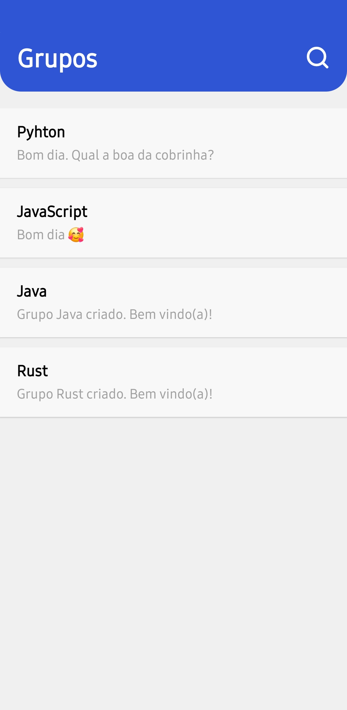
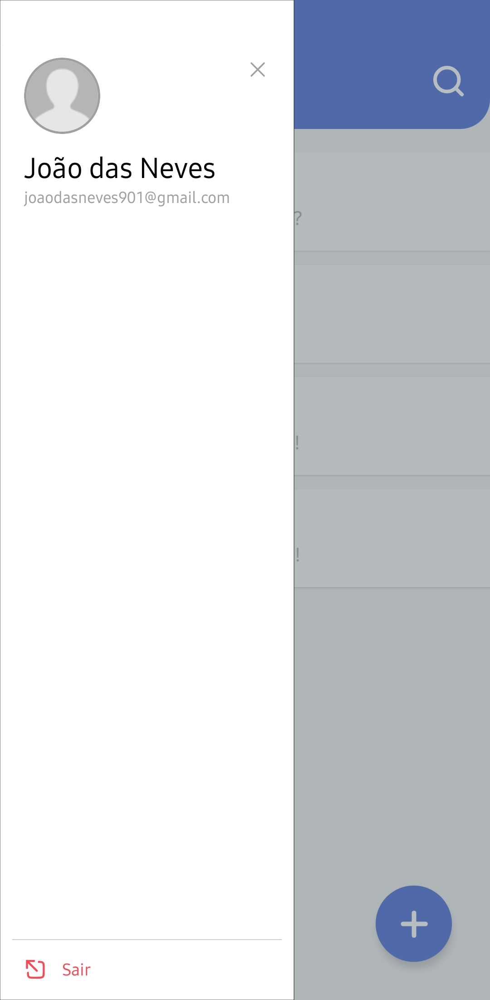
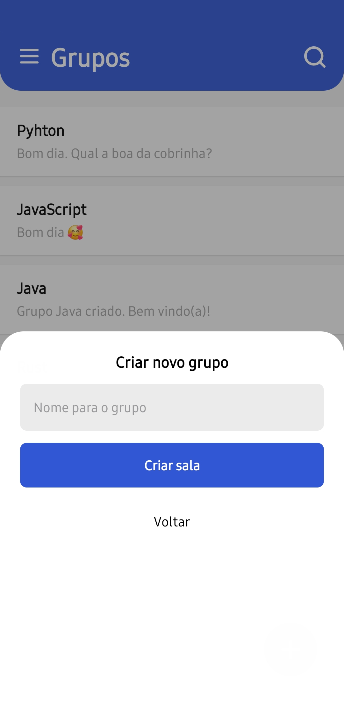

# Hey Grupos!

Este é um projeto em React Native desenvolvido no curso *Fábrica de Aplicativos* do [Sujeito Programador](https://github.com/sujeitoprogramador).

<div style="display: flex; gap: 12px; flex-wrap: wrap">
    
    
    
    
</div>

  
## Tecnologias utilizadas

- [React Native](https://reactnative.dev)
- [TypeScript](https://www.typescriptlang.org/)
- [React Navigation](https://reactnavigation.org/)
- [Firebase](https://firebase.google.com)

## Como rodar localmente

Este projeto foi criado usando React Native Community cli, portanto você pode seguir a documentação oficial para fazer deploy do app localmente.

>[!TIP]
>**Pré-requisitos**:
>- No Windows e no Linux: 
>    - o Android Studio instalado.
>    - SDK do Android 14 ou superior instalado.
>- No Mac, o emulador do iOS.


No caso, primeiro você precisará baixar o projeto com executando o seguinte comando no terminal:

```
git clone https://github.com/RenanSantos7/heygrupos.git
```

Agora, instale as dependências:

```
npm i
```

E por fim rode o projeto com:

```
npx react-native run-android // para a versão android
npx react-native run-ios // para a versão ios
```

O emulador será aberto com o app rodando.

## Licensa

O projeto está disponível publicamente com a licença [MIT](./LICENSE)
